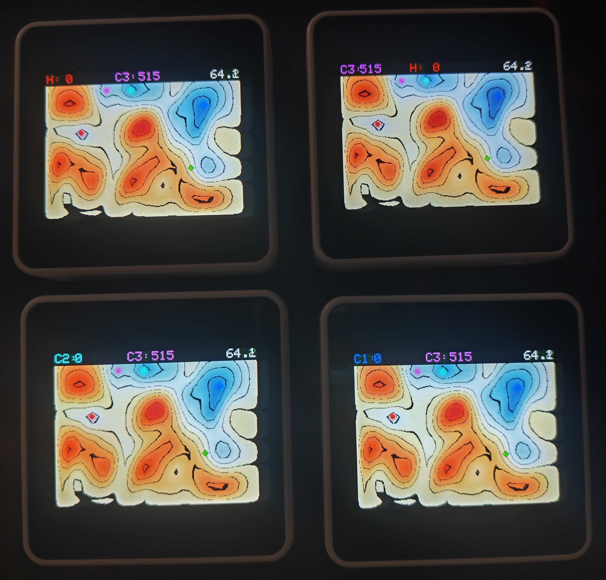
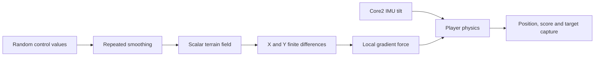
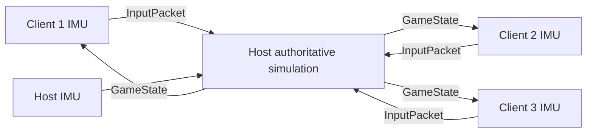

# Gradients v1.17

**Gradients** is a motion-controlled game for the M5Stack Core2 in which the terrain is not merely a background: its numerical gradient acts as a force on every player.

<p align="center">
  
</p>

Tilt the device to steer toward a shrinking green target. Reach it quickly for more points and extra play time. In multiplayer, one Core2 runs the authoritative simulation while up to three additional M5Stack devices send IMU input and display the same procedurally generated landscape over ESP-NOW.

No external sensors, wiring, phone, router, or PC are required during play.

## Features

- Single-player and multiplayer in one firmware
- One host plus up to three clients
- IMU tilt control with neutral-position calibration and dead zone
- Long-press **A** during gameplay to recalibrate the IMU
- Procedurally generated, smoothed scalar terrain
- Terrain-gradient forces integrated into player physics
- Deterministic terrain synchronization from a shared random seed
- Host-authoritative ESP-NOW simulation at approximately 40 network updates per second
- Direct on-device role selection and host/client pairing
- Persistent roles and paired MAC addresses in NVS
- Automatic disconnect detection and reconnection
- Sound, vibration, battery status, and USB-aware idle power management
- Time-dependent target value from 1000 down to 100 points
- Target size visually indicates its current bonus value
- Post-game score-history graph
- In-app **Play Again** and **Main Menu** flow
- Persistent single-player high score

## Primary hardware

- M5Stack Core2

The sketch uses M5Unified and a fixed 320 × 240 layout. It also contains input and display support intended for other 320 × 240 M5Stack devices, including CoreS3 and classic Core/Fire models, but the contest release should be considered primarily a Core2 build unless those boards are separately tested.

## How the game works

A 33 × 25 array of random control values is repeatedly smoothed to form a continuous-looking scalar field. The program calculates horizontal and vertical finite differences from this field and uses them as local terrain forces.

The player's acceleration therefore combines:

1. IMU tilt input
2. Local terrain-gradient force
3. Velocity damping
4. Boundary or collision response

Capturing the green diamond adds its current value to the player's score and extends the game by two seconds. The value starts at 1000 points and decreases to a minimum of 100 while the target remains uncaptured.



## Multiplayer architecture

The host generates the random terrain seed and runs all gameplay physics, collision handling, target captures, scoring, and timing. Each client sends only its local calibrated tilt input. The host sends a recipient-specific synchronized game state back to every active client.



A paired client is considered connected only while input packets arrive within the connection timeout. Timed-out clients receive neutral input on the host and automatically rejoin when communication resumes. Clients display a **CONNECTION LOST / RECONNECTING** overlay when host state packets stop.

## Requirements

### Hardware

- 1 to 4 M5Stack Core2 devices
- USB-C cable for programming each device

### Software

- Arduino IDE
- ESP32/M5Stack board support
- `M5Unified`
- `M5GFX` (normally installed with M5Unified)

The sketch also uses libraries supplied by the ESP32 Arduino platform:

- `Preferences`
- `WiFi`
- `esp_now`
- `esp_system`
- `esp_wifi`
- `esp_idf_version`

## Installation

Arduino requires the sketch folder and main `.ino` filename to match.

1. Create a folder named:

   ```text
   Gradients_SP_MP_1_17
   ```

2. Place this file inside it:

   ```text
   Gradients_SP_MP_1_17/Gradients_SP_MP_1_17.ino
   ```

3. Open the sketch in Arduino IDE.
4. Select the M5Stack Core2 board and the correct serial port.
5. Install or update M5Unified if required.
6. Compile and upload the same firmware to every device.

The compile-time setting below is only a fallback for a device with no saved role:

```cpp
#define DEFAULT_IS_HOST_DEVICE 0
```

The active multiplayer role is normally loaded from NVS and can be changed during boot or through the Serial Monitor.

## Controls

### Startup and menu

| Action | Core2 control |
|---|---|
| Start single-player | **A** or touch left half |
| Start multiplayer | **B** or touch right half |
| Pair host and client | **C** / bottom-right virtual button |
| Save HOST role | Hold **A** during boot |
| Save CLIENT role | Hold **B** during boot |
| Clear stored host client slots | Hold **C** while booting a saved HOST |

Single-player can start from either a saved HOST or CLIENT device without changing its stored multiplayer role.

### Gameplay

| Action | Control |
|---|---|
| Move | Tilt the device |
| Recalibrate neutral position | Hold **A** for approximately 1.2 seconds |

### Post-game

| Action | Control |
|---|---|
| Play again | **A** or touch left half |
| Return to main menu | **B** or touch right half |

## No-PC multiplayer setup

### 1. Set one device as host

Restart the selected host while holding **A**. The HOST role is saved in NVS.

### 2. Set each other device as a client

Restart each client while holding **B**. The CLIENT role is saved in NVS.

### 3. Pair one client at a time

From the startup menu, press **C** on the host and **C** on one client at approximately the same time.

Repeat for up to three clients. The host accepts only one new client during each pairing window, which keeps the process deterministic when several devices are powered.

### 4. Start multiplayer

Select **B: Multi** on the host and all paired clients.

The clients wait for the first host state packet, recreate the terrain from the shared seed, and then join with their assigned player IDs.

## Player identities

| Player | Role | Color |
|---|---|---|
| H | Host | Red |
| C1 | Client 1 | Blue |
| C2 | Client 2 | Cyan |
| C3 | Client 3 | Magenta |

The local player's score is always shown first in the HUD. The second value shows the leading competitor, or the runner-up when the local player is leading. On the host, a timed-out client is shown as `LOST C1`, `LOST C2`, or `LOST C3`.

## Serial configuration

Open Serial Monitor at **115200 baud** with newline enabled.

Useful commands:

```text
HELP
CFG?
CONFIG?
MAC?
ROLE?
ROLE HOST
ROLE CLIENT
PEER 84:1F:E8:85:30:48
PEER 841FE8853048
PAIR HOST <client-local-mac>
PAIR CLIENT <host-local-mac>
PAIR?
PAIR HELP
RESETCFG
REBOOT
RESTART
VOL?
VOL 10
VOLUME?
VOLUME 10
SFX?
SFX ON
SFX OFF
SOUND?
SOUND ON
SOUND OFF
```

On a host, `CFG?` and `MAC?` show all three client slots. Serial pairing is intended as a fallback and diagnostic method; direct C-button pairing is the normal workflow.

Sound enable and volume are runtime settings in v1.17 and return to their defaults after reboot.

## Power behavior

Battery status is displayed in the startup menu. On battery power, the menu and post-game screen shut the device down after 60 seconds of inactivity.

When USB power is present, the idle timer is continuously reset so the device does not unexpectedly power off during development, demonstration, or charging.

## Repository files

- `Gradients_SP_MP_1_17.ino` — contest-release firmware
- `README.md` — setup, gameplay, and architecture documentation
- `CHANGELOG.md` — release history
- `RELEASE_NOTES_v1.17.md` — GitHub release text
- `LICENSE` — GNU General Public License v3

## Known limitations

- The maximum session size is four players: one host and three clients.
- ESP-NOW encryption is not enabled.
- Clients store one host MAC address.
- The UI is fixed at 320 × 240 pixels.
- Multiplayer replay and menu selections are made independently on each device; the host remains authoritative once a new match begins.
- Exact library and board-package versions should be recorded from the final tested build environment before publishing a reproducible binary release.

## License

Gradients is released under the GNU General Public License v3. See `LICENSE`.
